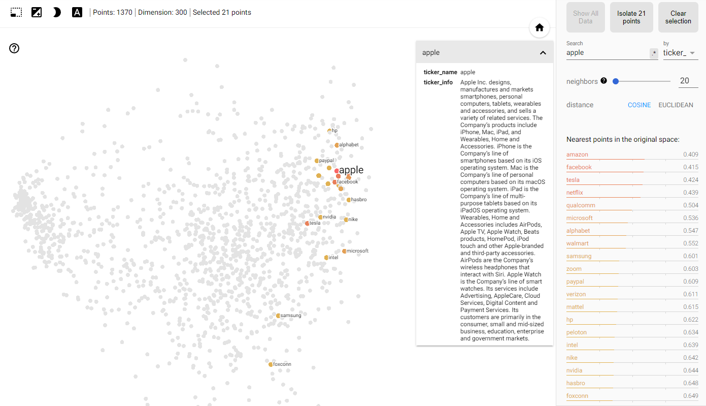

---

## **Environment**
- `pip install numpy pandas nltk gensim jupyter tqdm`
- `nltk.download('stopwords')` 
- `nltk.download('punkt')`

---

## **Pipline**
### *1. data_download.py*
Download data from mongodb and save as a pickle file.
### *2. data_process.py*
Data cleaning.
### *3. train.py*
Gensim word2vec.
### *4. test.ipynb*
- word similarity
- word analogy
- company vector
### *5. visualize.py*
Show vectors on Tensorboard

---

## **Document**

*Date: 2022-06-01*

After improving data processing, the word2vec model performs well in similarity and analogy.

### **Differences from the previous attemp on “Glove” model**

- Data cleaning :  more data cleaning operations, cut articles into sentences.
- Model :  gensim word2vec, train on cpu and much faster.
- Hyperparameters :  window_size=5 (we use 10 on Glove)

### **Data cleaning details**

1. remove “.“ in abbreviation.  “U.S.“ → “US.“
2. remove “,” in numbers.  “1,200,000“ → “1200000“
3. cut article into sentences (“.“ is useful in this step)
4. remove words in blocklist
5. remove punctuation
6. remove short sentences
7. remove stopwords

### **Test examples**

- Similarity

- Analogy

### **Multi-word expression recognition**

The above data processing divides the corpus into words one by one. For example, expression like “apple inc”, “covid-19”, are split into two words, they should be seen as one word.

I use a unsupervised method, that is, count the co-occurrences of two words. I have done two-words expression recognition in the last part of :  NLP_Stock2Vec/data_process.ipynb

### **TODO :  Multi-word expression recognition**

- The data is not clean enough, now get "3_2", "10_q", "0_04" in two-words expression.
- Multi-word expression which has more than two words, such as "COVID_19_pandemic".
- For known multi-word expression like "the British Museum", we can use them directly.
- When we can recognize multi-word expression, add a new data processing step to connect multi-word expression by "_". After concatenating multi words into one word, then train word2vec.

### **References**

[FinText | A Financial Word Embedding (rahimikia.com)](https://www.rahimikia.com/fintext)